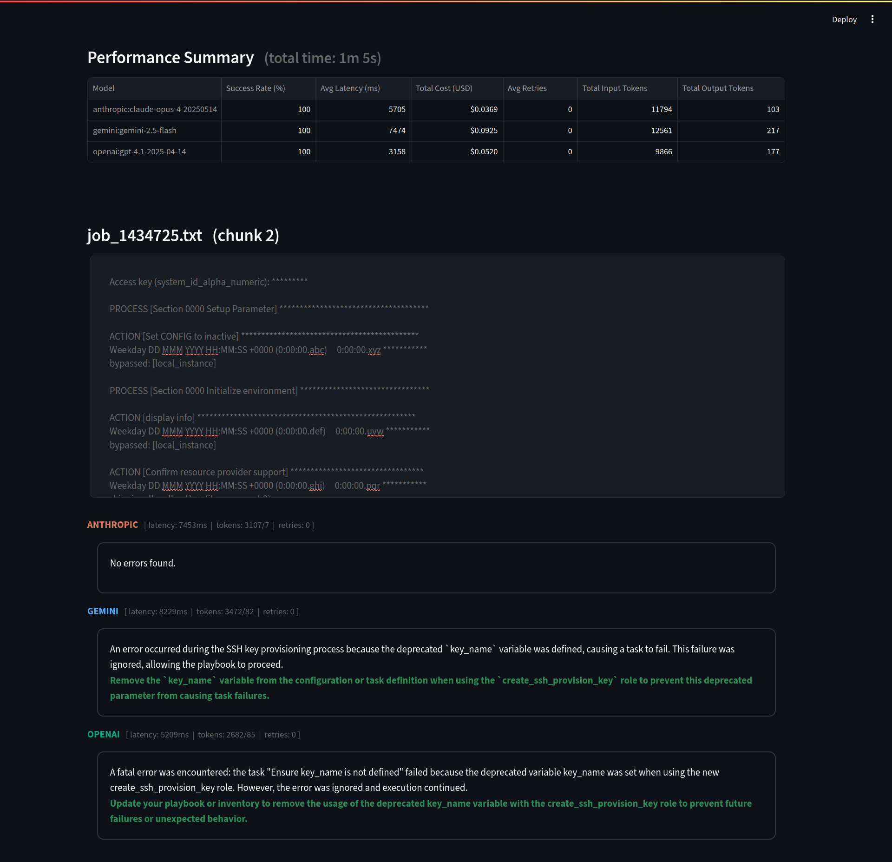

# Ansible Log LLM Evaluation

Proof-of-concept for evaluation of LLM performance on simple Ansible log analysis tasks.

> [!NOTE]
> This project was developed with assistance from AI tools.

## Overview

System ingests Ansible log files, chunks them for processing, sends them to various LLM providers (OpenAI, Anthropic, Gemini) for error analysis and summarization, then presents results through a Streamlit dashboard with performance comparisons for Gemini, Claude & ChatGPT.

Inline-style: 



## Setup

1. **Install dependencies:**
   ```bash
   pip install -r requirements.txt
   ```

2. **Configure .env variables:**
   ```
   OPENAI_API_KEY="your_key_here"
   GEMINI_API_KEY="your_key_here"  
   ANTHROPIC_API_KEY="your_key_here"
   LANGSMITH_API_KEY="your_key_here"  # Optional for tracing
   ```

3. **Add log files:**
   Place Ansible log files (.txt) in the `ansible_logs/` directory

4. **Configure settings:**
   Edit `config.yaml` to adjust:
   - models
   - pricing
   - concurrency
   - prompting
   - processing parameters
   - data reset on startup
   - UI development mode

## Usage

> [!CAUTION]
> **Data sensitivity**: Ensure log files contain no sensitive information before processing
>
> **Cost awareness**: Monitor token usage; configure rate limits appropriately

**Standard run:**
```bash
python main.py
```

**UX development mode** (preserves data, skips LLM calls):
```yaml
# config.yaml
database:
  clear_on_startup: false
app_settings:
  ux_development_mode: true
```

The system will process logs, generate summaries, and launch the reporting interface at the configured host/port (default: http://localhost:1111).


